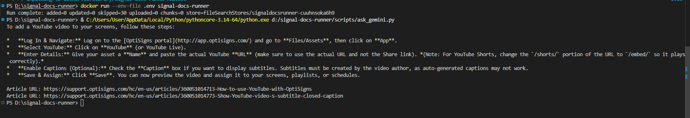

# Signal Docs Runner

Daily documentation ingestion job for a Gemini File Search customer-support knowledge base.

## Setup

```bash
python -m venv .venv
.venv\Scripts\activate
pip install -r requirements.txt
copy .env.sample .env
```

Required variables:

```env
GEMINI_API_KEY=your_api_key
GEMINI_FILE_SEARCH_STORE_NAME=fileSearchStores/your-store
ARTICLE_LIMIT=30
SUPPORT_BASE_URL=https://support.optisigns.com
```

Leave `GEMINI_FILE_SEARCH_STORE_NAME` blank on the first upload run. The script will create a store and print the store name to add back into `.env`.

## Run Locally

```bash
python main.py
python scripts/ask_gemini.py
```

The job scrapes support articles, converts them to Markdown, detects added or updated files, uploads only deltas to Gemini File Search, and prints run counts.

## Docker

```bash
docker build -t signal-docs-runner .
docker run --env-file .env signal-docs-runner
```

## Assistant Prompt

```text
You are OptiBot, the customer-support bot for OptiSigns.com.
• Tone: helpful, factual, concise.
• Only answer using the uploaded docs.
• Max 5 bullet points; else link to the doc.
• Cite up to 3 "Article URL:" lines per reply.
```

## Daily Job

GitHub Actions runs the ingestion job daily at 02:00 UTC and also supports manual runs.

Before running it, add these repository secrets:

```text
GEMINI_API_KEY
GEMINI_FILE_SEARCH_STORE_NAME
```

Logs: https://github.com/ngociss/signal-docs-runner/actions/workflows/daily-ingest.yml

## Sample Answer Screenshot



## Chunking Strategy

Gemini File Search is configured with whitespace chunking at 512 max tokens per chunk and 64 overlap tokens. The run log prints the estimated number of chunks embedded for changed files.
